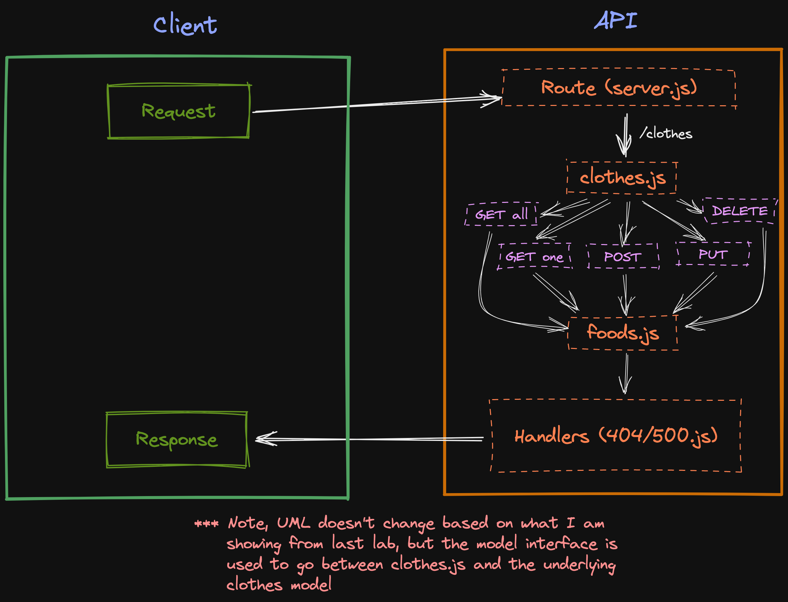

# Lab - Class 04

## Project: API Server

### Author: Julian Barker

### Problem Domain  

This repo builds on the last lab's API server by using a model interface to simplify the interaction between client and server and reuse it across multiple models.

### Links and Resources

- [ci/cd](https://github.com/julian-barker/api-server/actions)
- [deployment](https://four01-api-server.onrender.com)

### Setup

#### `.env` requirements (where applicable)

- `PORT` - 3001
- `DATABASE_URL` - postgres://localhost:5432/\<database-name\>?sslmode=disable

#### How to initialize/run your application (where applicable)

- `npm run dev` (alias for `npx tsc --watch & nodemon -q -w dist dist/index.js`)

#### Features / Routes

- GET : `/` - return "We're live!!!"
- GET : `/clothes` - gets all records from the clothes table
- GET : `/clothes/:id` - gets a single record by id
- POST : `/clothes` - inserts a new record; takes an object in the request body as fields to populate
- PUT : `/clothes/:id` - updates a single record by id; takes an object in the request body as fields to be updated
- DELETE : `/clothes/:id` - deletes a single record by id

#### Tests

- `npm test` (alias for `NODE_ENV=test npx tsc && jest --verbose --coverage`)

#### UML

### Attributions
